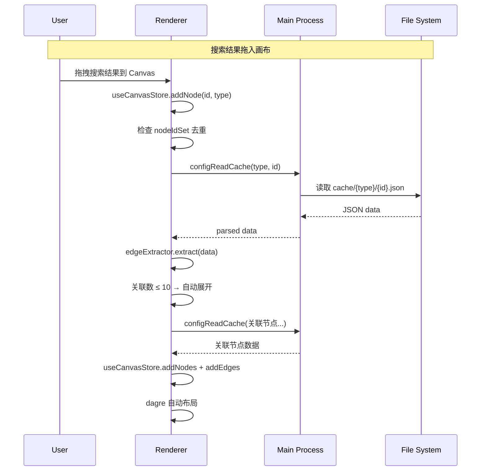

# Design Document: Sultan Game Reader

## Overview

苏丹的游戏本地剧情阅读器是一个 Electron 桌面应用，用于读取游戏本地配置文件和图片资源，以节点图 + 类视觉小说形式呈现游戏剧情结构。

应用采用经典的 Electron 双进程架构：Main Process 负责文件系统访问、配置解析、IPC 通信；Renderer Process 基于 React + Vite 构建 UI，使用 @xyflow/react 渲染节点图画布，Zustand 管理全局状态。

数据流为单向管道：用户选择游戏目录 → Parser 读取 config/ → CacheManager 写入 cache/ → Renderer 通过 IPC 从 cache/ 读取。图片资源通过 AssetStudio CLI 提取到 resource/ 目录，Renderer 通过 Image_Resolver 解析路径后加载。

核心设计决策：
- 前端只依赖 `cache/` 和 `resource/` 两个目录，不直接读取游戏原始配置文件
- 解析器模块（commentStripper、gameConfigParser、cacheManager）已完成并通过 2934 个文件 100% 验证，作为已有资产直接集成
- 条件表达式保留原始 key 名（含 `!`、`>=`、`.` 等特殊字符），仅在展示层通过 Condition_Parser 转义为人类可读文本
- 图片查找需同时尝试 `.png` 和 `.png.png` 双后缀（AssetStudio 提取产物）

## Architecture

```mermaid
graph TB
    subgraph Electron Main Process
        M[main.js] --> P[Parser Module]
        M --> CM[CacheManager]
        M --> IPC[IPC Handlers]
        M --> Settings[Settings Store<br/>electron-store]
        P --> CS[commentStripper.js]
        P --> GCP[gameConfigParser.js]
    end

    subgraph Preload
        PL[preload.js<br/>contextBridge API]
    end

    subgraph Renderer Process - React + Vite
        App[App.jsx<br/>Router] --> SP[SettingsPage]
        App --> MainLayout[MainLayout]
        MainLayout --> Search[SearchPanel]
        MainLayout --> Canvas[Canvas<br/>@xyflow/react]
        MainLayout --> Detail[DetailPanel]
        MainLayout --> Counter[CounterPanel]

        subgraph Zustand Stores
            CS2[useConfigStore]
            CAS[useCanvasStore]
            PS[usePlayerStore]
        end

        subgraph Services
            CL[configLoader]
            IR[imageResolver]
            EE[edgeExtractor]
            CP[conditionParser]
            AE[assetExtractor]
        end
    end

    IPC <-->|contextBridge| PL
    PL <-->|window.electronAPI| App
    CM -->|read/write| Cache[(cache/)]
    M -->|spawn| AS[AssetStudio CLI]
    AS -->|extract| Res[(resource/)]
    IR -->|resolve| Res
    CL -->|IPC read| Cache
```

### 进程间通信设计

Main Process 通过 `ipcMain.handle` 注册异步 IPC handler，Renderer 通过 preload 暴露的 `window.electronAPI` 对象调用。所有文件系统操作封装在 Main Process 中，Renderer 无直接 fs 访问权限。

IPC 通道分为四组：
1. **config:** — 配置解析与缓存管理（setGameDir, rebuildCache, clearCache, readCache, listCache, buildIndex）
2. **asset:** — 资源提取与图片解析（setCliPath, extract, resolveImage）
3. **file:** — 原始文件读取（readRaw）
4. **settings:** — 用户设置持久化（get, set）

### 状态管理架构

```mermaid
graph LR
    subgraph useConfigStore
        Index[searchIndex<br/>Map&lt;id, entry&gt;]
        Cards[cardsMap<br/>Map&lt;id, card&gt;]
        Counters[counterRegistry<br/>Map&lt;id, counter&gt;]
    end

    subgraph useCanvasStore
        Nodes[nodes<br/>XYFlow Node[]]
        Edges[edges<br/>XYFlow Edge[]]
        NodeSet[nodeIdSet<br/>Set&lt;string&gt;]
        Selected[selectedNode]
    end

    subgraph usePlayerStore
        Triggered[triggeredEvents<br/>Set&lt;id&gt;]
        CounterVals[counterValues<br/>Map&lt;id, number&gt;]
    end
```

- **useConfigStore**: 管理搜索索引、卡牌名称映射表（供 conditionParser 解析 `have.卡牌ID`）、计数器注册表
- **useCanvasStore**: 管理画布节点/边状态、节点去重集合、当前选中节点
- **usePlayerStore**: 管理玩家模拟状态（已触发事件、计数器模拟值），持久化到 Electron userData

## Components and Interfaces

### Main Process 模块

| 模块 | 职责 |
|---|---|
| `electron/main.js` | Electron 入口，注册 IPC handlers，管理 BrowserWindow |
| `electron/preload.js` | contextBridge 暴露 IPC API 到 renderer |
| `electron/parser/commentStripper.js` | 注释剥离（已完成） |
| `electron/parser/gameConfigParser.js` | 配置解析（已完成） |
| `electron/parser/cacheManager.js` | 缓存管理（已完成） |

### IPC 接口定义

```typescript
// preload.js 暴露的 API 类型定义（仅作文档参考，实际为 JS）
interface ElectronAPI {
  // 配置管理
  configSetGameDir(gamePath: string): Promise<{ configDir: string; success: boolean }>
  configRebuildCache(onProgress?: (current: number, total: number) => void): Promise<{ total: number; errors: string[] }>
  configClearCache(type?: string): Promise<{ success: boolean }>
  configReadCache(type: string, id: string): Promise<object>
  configListCache(type: string): Promise<Array<{ id: string; name?: string; text?: string }>>
  configBuildIndex(): Promise<Array<{ id: string; type: string; name: string; text: string }>>

  // 资源管理
  assetSetCliPath(cliPath: string): Promise<{ success: boolean }>
  assetExtract(params: { gamePath: string; outputDir: string }): Promise<{ success: boolean; log: string }>
  assetResolveImage(pic: string): Promise<string | null>

  // 文件读取
  fileReadRaw(filePath: string): Promise<string>

  // 设置
  settingsGet(key: string): Promise<any>
  settingsSet(key: string, value: any): Promise<void>
}
```

### Renderer 组件

| 组件 | 职责 |
|---|---|
| `App.jsx` | 路由：设置页 vs 主布局 |
| `SettingsPage.jsx` | 游戏目录、AssetStudio 路径、缓存/资源管理 |
| `SearchPanel.jsx` | 左侧搜索面板，关键字搜索 + 类型过滤 + 拖拽 |
| `Canvas.jsx` | @xyflow/react 画布，节点渲染、Edge 样式、自动布局 |
| `DetailPanel.jsx` | 右侧详情面板，根据节点类型分发到子组件 |
| `CounterPanel.jsx` | 计数器/开关管理侧拉栏 |
| `nodes/EventNode.jsx` | Event 类型自定义节点 |
| `nodes/RiteNode.jsx` | Rite 类型自定义节点 |
| `nodes/LootNode.jsx` | Loot 类型自定义节点 |
| `nodes/AfterStoryNode.jsx` | AfterStory 类型自定义节点 |
| `nodes/CardNode.jsx` | Card 类型自定义节点 |
| `nodes/GenericNode.jsx` | Over/Upgrade/DT 通用节点 |

### Service 模块

| 模块 | 职责 |
|---|---|
| `services/configLoader.js` | 通过 IPC 从 cache 加载数据，构建内存索引 |
| `services/imageResolver.js` | 图片路径解析：`pic` 字段 → resource/ 实际路径，含 `.png.png` 双后缀回退 |
| `services/edgeExtractor.js` | 从节点数据递归提取关联边（event_on, rite, loot, card 等） |
| `services/conditionParser.js` | 条件 key → 人类可读文本（have, counter, table_have, any, s.is, r:>=） |

### 关键交互流程



## Data Models

### 节点类型与缓存结构

所有缓存文件共享元数据前缀：

```typescript
interface CacheMeta {
  _source_path: string    // 原始文件绝对路径
  _cached_at: number      // 缓存时间戳 (ms)
  _source_mtime: number   // 原始文件 mtime (ms)
  _parse_error: string | null
}
```

#### Event (cache/event/{id}.json)
```typescript
interface EventData extends CacheMeta {
  id: number              // 53xxxxx
  text: string            // 事件标题/备注
  text__c?: string        // 行尾注释
  is_replay: number
  auto_start: boolean
  on?: object             // 触发条件
  condition: object       // 前置条件
  settlement: Settlement[]
}

interface Settlement {
  tips_text?: string
  tips_resource?: string
  condition?: object
  __c?: string            // 条目注释
  __ca?: string           // 上方注释
  action: {
    confirm?: { id: string; text: string; icon?: string[] }
    option?: Array<{ text: string; action: object }>
    slide?: { pics: string[]; text: string }
    prompt?: object
    success?: ActionResult
    failed?: ActionResult
  }
}

interface ActionResult {
  event_on?: number | number[]
  event_off?: number | number[]
  rite?: number | number[]
  loot?: number | number[]
  card?: number | number[]
  [conditionKey: string]: any  // counter+, counter-, have. 等
}
```

#### Rite (cache/rite/{id}.json)
```typescript
interface RiteData extends CacheMeta {
  id: number              // 50xxxxx
  name: string
  text: string
  settlement_prior?: Settlement[]  // 前置结算
  settlement: Settlement[]         // 主结算
  settlement_extre?: Settlement[]  // 额外结算
  cards_slot?: object
}
```

#### Loot (cache/loot/{id}.json)
```typescript
interface LootData extends CacheMeta {
  id: number              // 60xxxxx
  name: string
  type: number
  type__c?: string
  item: Array<{
    id: string
    type: string
    num: string
    weight: number
  }>
}
```

#### AfterStory (cache/after_story/{id}.json)
```typescript
interface AfterStoryData extends CacheMeta {
  id: number              // 20xxxxx
  name: string
  extra: Array<{
    key: string
    key__c?: string       // 条目名称注释
    sort?: number
    pic?: string          // 图片路径 (cards/xxx)
    condition?: object
    result_text: string
    __ca?: string         // 上方注释 → 章节标题
  }>
}
```

#### Card (cache/single/cards.json 内)
```typescript
interface CardData {
  id: number              // 20xxxxx
  name: string
  title?: string
  text?: string
  resource?: string       // 立绘路径
  tag?: object
  rare?: number
}
```

#### DT (cache/dt/{id}.json)
```typescript
interface DTData extends CacheMeta {
  dialog_tree_id: string  // "DT1" ~ "DT9"
  first_word_id: string
  description: string
  Item: Array<{
    word_id: string
    word: string
    jump_type: string     // "0"=直接跳转, "1"=选项, "3"=结束
    direct_id: string
    Option: Array<{
      option_Jump_word: string
      option_Jump_id: string
      option_Jump_condition?: object
      action?: object
    }>
    action?: object
  }>
}
```

### 画布数据模型

```typescript
// 节点 ID 格式: "{type}:{id}" e.g. "event:5300000"
interface CanvasNode {
  id: string              // "{type}:{id}"
  type: string            // event|rite|loot|after_story|card|over|upgrade|dt
  position: { x: number; y: number }
  data: {
    label: string         // id + name/text 摘要
    nodeType: string
    rawData: object       // 完整缓存数据
  }
}

interface CanvasEdge {
  id: string              // "{source}->{target}:{path}"
  source: string          // 源节点 ID
  target: string          // 目标节点 ID
  data: {
    path: string          // JSON path (e.g. "settlement[0].action.success.event_on")
    branchType: 'success' | 'failed' | 'default'
    conditionText?: string // 关联注释文本
  }
  style: {
    stroke: string        // green/red/gray
  }
}
```

### Edge 提取规则

| 源字段 | 方向 | 目标类型 | 说明 |
|---|---|---|---|
| `event_on` | current → event | event | 触发事件 |
| `event_off` | current → event | event | 关闭事件 |
| `rite` | current → rite | rite | 关联仪式 |
| `loot` | current → loot | loot | 关联战利品 |
| `rite_end` | rite → event | event | 仪式结束触发 |
| `card` | current → card | card | 关联卡牌 |
| `link_card` | upgrade → card | card | 升级关联卡牌 |

Edge 提取需递归遍历 settlement 数组中的 `action.success`、`action.failed`、以及嵌套的 condition 对象。branchType 由所在路径决定：位于 `success` 下为 success，位于 `failed` 下为 failed，其余为 default。

### 条件表达式解析规则

| 原始 key 模式 | 正则 | 展示格式 |
|---|---|---|
| `have.<cardId>` | `/^have\.(.+)$/` | 拥有 [卡牌名] |
| `!have.<cardId>` | `/^!have\.(.+)$/` | 不拥有 [卡牌名] |
| `counter.<id>>=` | `/^counter\.(\d+)>=$/` | 计数器 [注释] ≥ 值 |
| `counter.<id><` | `/^counter\.(\d+)<$/` | 计数器 [注释] < 值 |
| `counter.<id>=` | `/^counter\.(\d+)=$/` | 计数器 [注释] = 值 |
| `counter+<id>` | `/^counter\+(\d+)$/` | 计数器 [注释] +值 |
| `counter-<id>` | `/^counter-(\d+)$/` | 计数器 [注释] -值 |
| `table_have.<t>.<f>` | `/^table_have\.(.+)\.(.+)$/` | 表 [t] 存在 [f] |
| `any` | 字面量 | 满足任意一项: [子条件] |
| `s<d>.is` | `/^s(\d+)\.is$/` | 卡位 [d] 是 [卡牌名] |
| `r<d>:<a>+<a>>=` | `/^r(\d+):(.+)>=$/` | 检定 [属性] ≥ [阈值] |

解析优先级：`__c` 注释文本 > 卡牌名称查表 > 原始 key 名。

### 图片路径解析链

```
pic 字段值 (e.g. "cards/2000001")
  ↓ 提取 name (去掉 "cards/" 前缀)
  ↓
尝试 1: resource/Sprite/{name}.png
  ↓ 不存在
尝试 2: resource/Sprite/{name}.png.png
  ↓ 不存在
尝试 3: resource/Texture2D/{name}.png
  ↓ 不存在
尝试 4: resource/Texture2D/{name}.png.png
  ↓ 不存在
返回 null → UI 显示占位图
```

